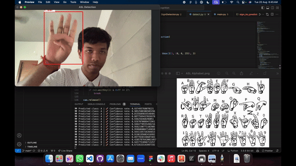

# Sign Language Recognition

This project is a real-time American Sign Language (ASL) detection system that uses a pre-trained deep learning model to recognize hand gestures captured through a webcam. The system utilizes MediaPipe for hand landmark detection and PyTorch for gesture classification.



## Repository Structure

```plaintext
sign-language-recognition/
│
├── main/
│   ├── detect.py               # Main script for running the ASL detection system
│   ├── model/
│   │   └── efficientnet_model.pth  # Pre-trained EfficientNet model for gesture recognition
│   ├── actions.py              # Action handler to execute actions based on detected gestures
│   └── neuralnet.py            # Neural network model definition (EfficientNetB0)
│
├── test/                       # Contains testing scripts and previous iterations of the project
│
└── train/                      # Contains scripts and files for model training
```

## Requirements

- Python 3.7+
- PyTorch
- TorchVision
- OpenCV
- MediaPipe
- Pillow
- NumPy

You can install the required packages using the following command:

```bash
pip install torch torchvision opencv-python mediapipe pillow numpy
```

## Usage

To run the ASL detection system, simply execute the `detect.py` script:

```bash
python main/detect.py
```

### Script Overview (`main/detect.py`)

- **Device Setup**: Automatically selects the GPU if available; otherwise, defaults to CPU.
  
- **Model Loading**: Loads a pre-trained EfficientNet model (`efficientnet_model.pth`) for ASL gesture classification.
  
- **MediaPipe Hands Initialization**: Configures MediaPipe to detect hand landmarks from the video feed.
  
- **Class Labels**: Maps numeric predictions from the model to ASL gestures (A-Z, space, delete, nothing).
  
- **Video Capture**: Accesses the webcam feed and processes each frame to detect and classify ASL gestures.
  
- **Gesture Recognition**:
  - Detects hands using MediaPipe and crops the region around the hand.
  - Pre-processes the cropped hand image and feeds it to the neural network.
  - Predicts the ASL gesture with the model and retrieves the confidence score.
  - Executes the corresponding action using the `ActionHandler`.
  
- **Visualization**:
  - Draws bounding boxes around detected hands.
  - Displays the predicted gesture and confidence score above the bounding box.
  - Opens a live video window showing real-time gesture detection.

### Actions

The `ActionHandler` class in `actions.py` defines the behavior for each recognized gesture. These actions can be customized as needed.

### Model Training

The training scripts and configurations are located in the `train/` directory. You can modify these scripts to fine-tune or retrain the model using your own dataset.

## Contributions

Contributions to improve the system or add new features are welcome! Please fork the repository and create a pull request.

## License

This project is licensed under the MIT License. See the LICENSE file for more details.
